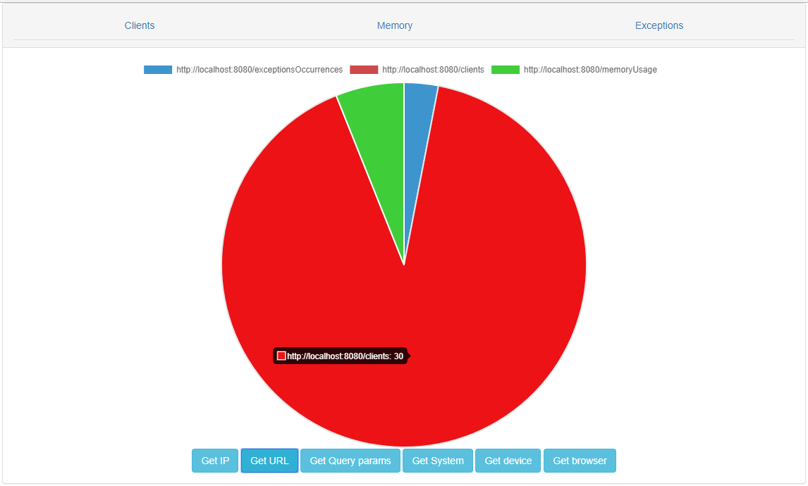
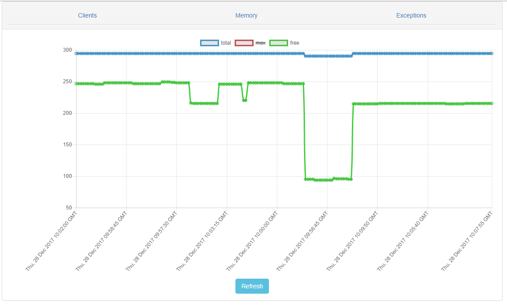

**TASK DEFINITION:**

Pick a technology used in web applications development. 
Figure out what's worth looking at from the application performance point of view.
Think of some performance metrics. Write a script (python would be nice) or program (java/c++) 
that collects your metrics every minute and stores them for some period of time.
Add a CSV export capability, present the results in a spread sheet or even present as a chart on a web page.
Be ready to answer questions about the implementation and your choice of metrics.

**SPECIFICATION:**

Technology used - Spring Boot, Spring AOP, Bootstrap, Chart.js

**Metrics:**

FULL PROCESSING TIME:
    SpringControllerAnalysisAspect.measureControllerMethodExecutionTime

ENDPOINT (Source (mobile/web), System, Browser, Browser version, IP source):
    SpringControllerAnalysisAspect.logRequestsPerClient    

EXCEPTIONS:
    SpringControllerAnalysisAspect.logExceptions
    
CPU/MEMORY USAGE OVER TIME:
    MemoryChecker.checkMemoryState
    
**USAGE**

To run the application use `mvn spring-boot:run`.

This is a proof of concept, so some sample endpoints are available:

`/clients` - returns registered access to endpoints, with data about the clients (IP, browser, system and similar)

`/memoryUsage` - returns the min/max/free memory of JVM

`/exceptionsOccurrences` - how many exceptions were thrown by @Controllers in the past hour

`/throwException` - throws generic exception, for testing purposes

`/throwSpecificException` - throws random exception out of two available ones - also for testing purposes

`/measurements?measurementType=` with parameters from MeasurementType.java - returns all of the gathered measurements starting from the application start

`/exportToCsv` - exports all current measurements into "export.csv" files in respective directories

`clients`, `memoryUsage` and `exceptionsOccurrences` data is available on charts available by default on `http://localhost:8080/measurements-home.html` 
  
Application serializes all of the gathered data every minute in the main application's directory, divided by measurement. Data is serialized to CSV file, with each file representing one minute of usage.
For now application holds all of the measured data in the memory, but it is possible to clean it out periodically or narrow down the direct data availability.  

Examples of available charts below:

